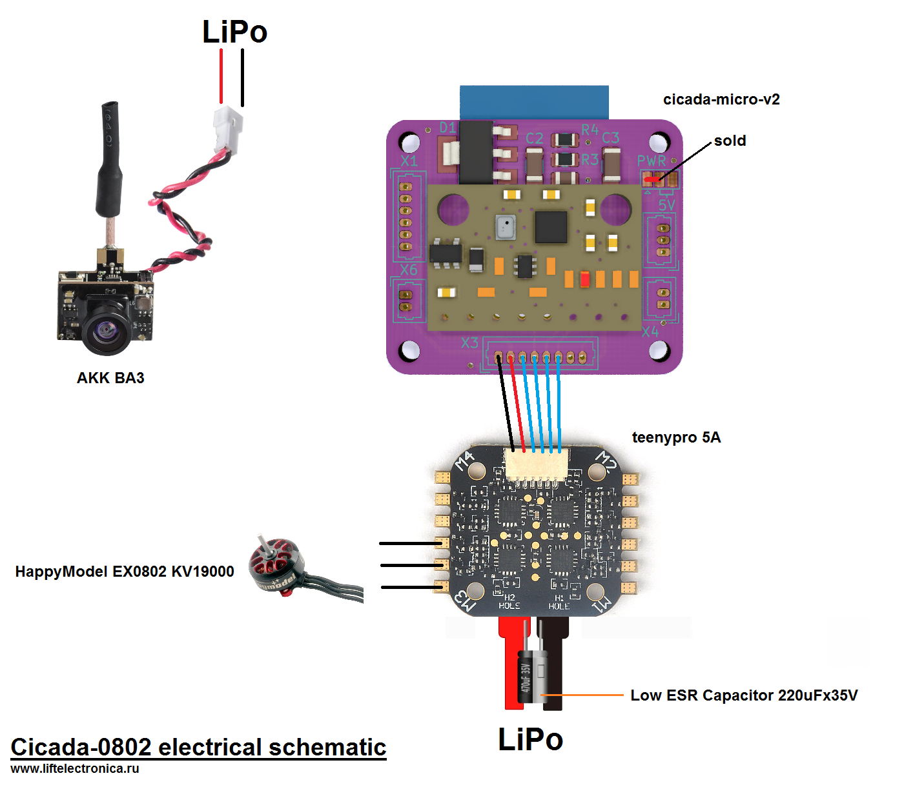
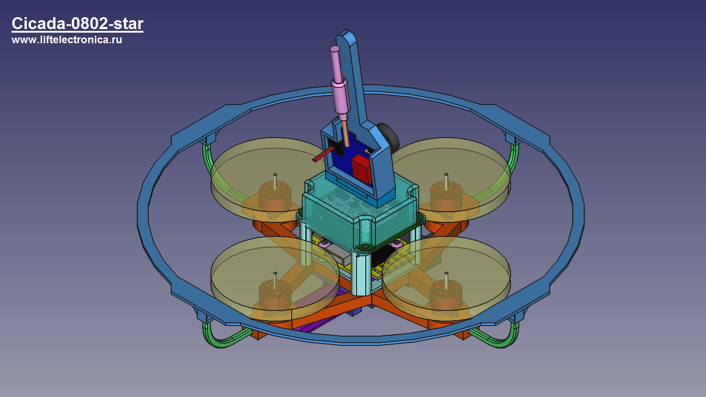
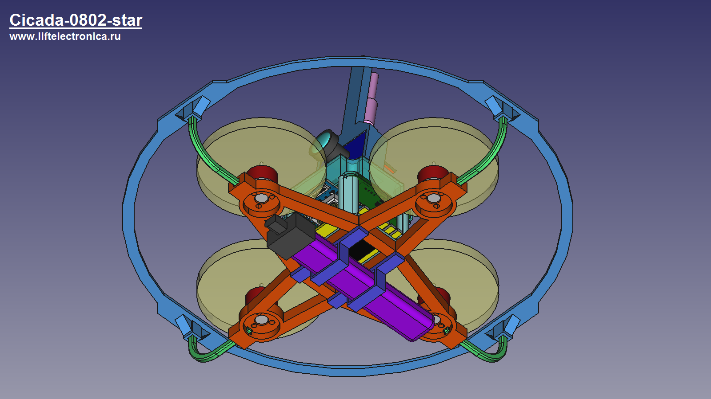

# Cicada-0802

Cicada-0802-star is FPV quadcopter based on Cicada Flight Controller. Distance between motors 75mm in diagonal. Mass is 48 gram with GNB-380mAh-LiHv-1S. Time of flight is about 2 minutes.

# Parts List
- cicada-micro-v2 - flight controller based on ESP-12E module
- teeny pro 5a - electronic speed controller
- happymodel RS0802 KV20000 - motors
- HQProp 40MMX3GR  - propellers
- akk ba3 - camera

# Electrical schematic

# Views

