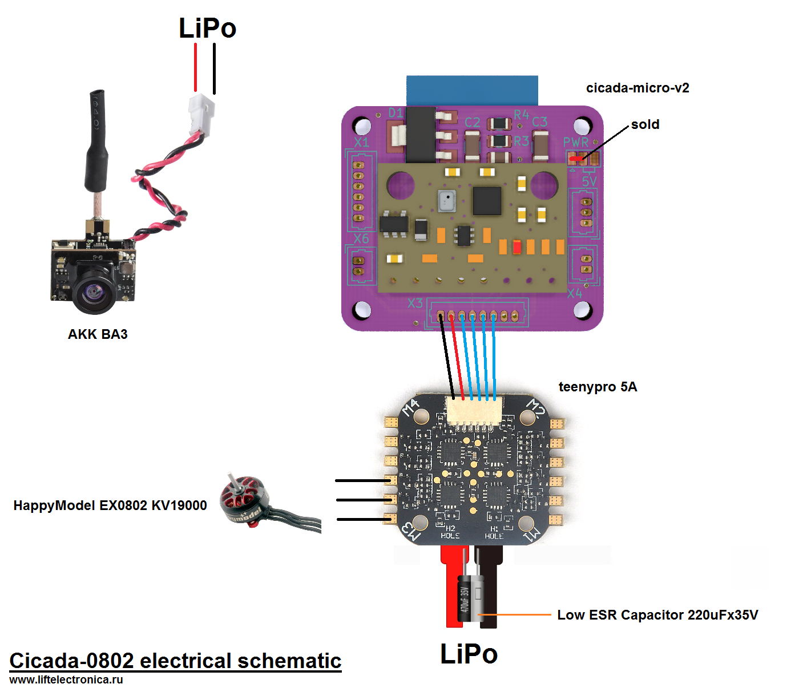
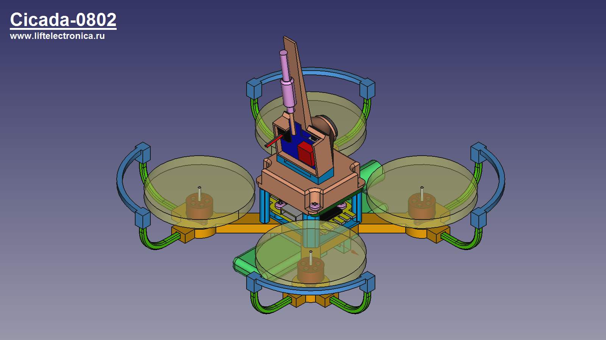
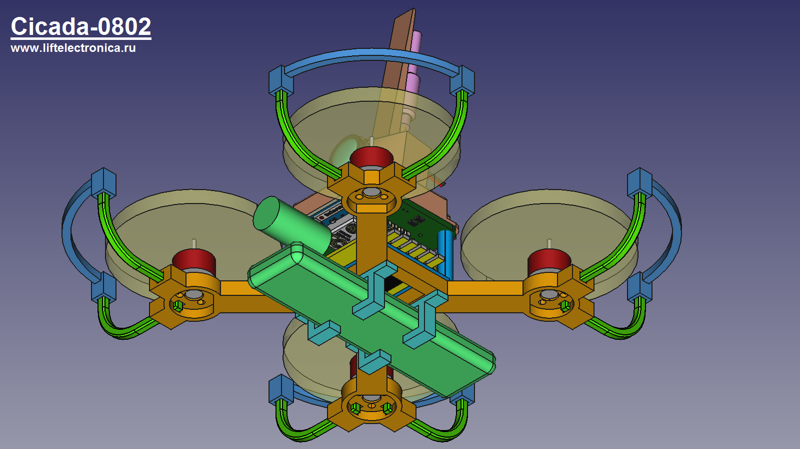

# Cicada-0802

Cicada-0802 is FPV quadcopter based on Cicada Flight Controller. Distance between motors 82mm in diagonal. Mass is 59 gram. Time of flight is about 3 minutes with GNB-550mAh-90C-1S battery.

# Parts List
- cicada-micro-v2 - flight controller based on ESP-12E module
- teeny pro 5a - electronic speed controller
- happymodel 0703 or 0802 KV19000 - motors
- HQProp 41mm-3blades - propellers
- akk ba3 or ewrf7082ve - camera

# Electrical schematic

# Views

