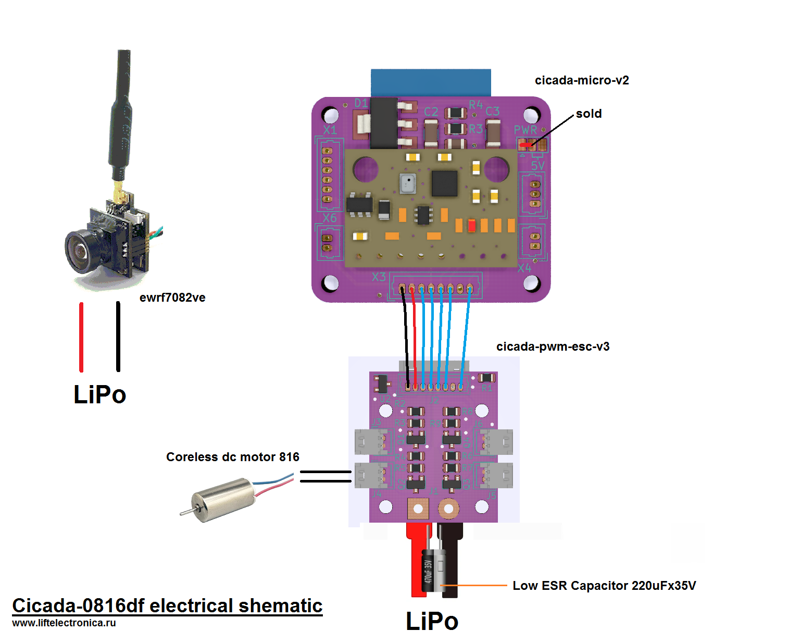
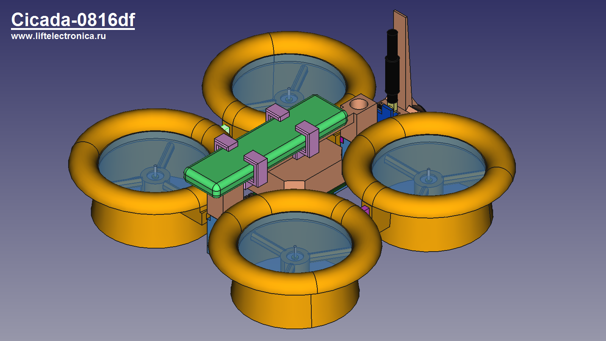
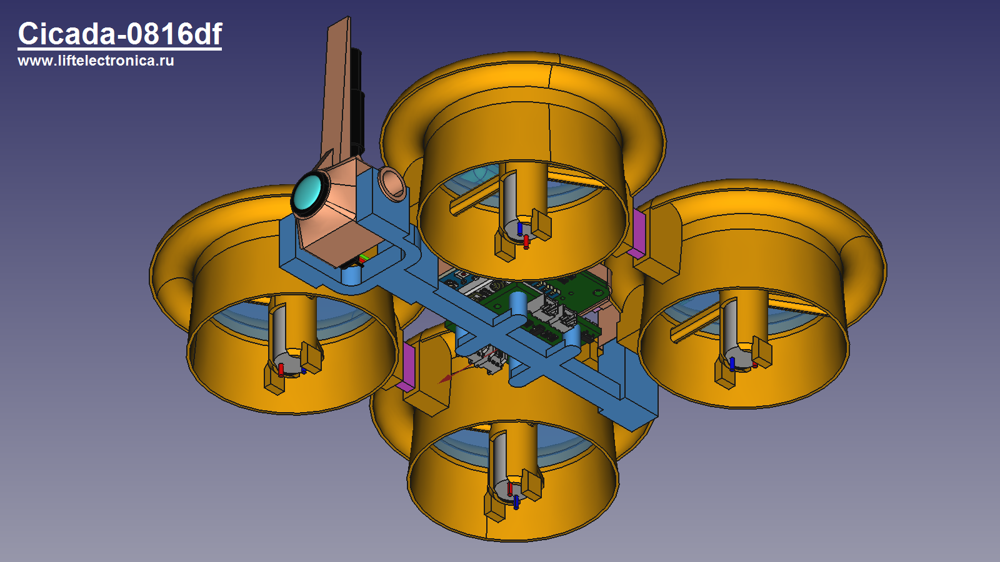

# Cicada-0816df

Cicada-0816df is FPV quadcopter based on Cicada Flight Controller. Distance between motors 96mm in diagonal. Mass is 94 gram. Time of flight is about 2 minutes with GNB-550mAh-90C-1S battery. Ducted fans were made based on [this article](https://capolight.wordpress.com/2015/01/14/quadcopter-rotor-duct/) Its really increase thrust of propellers but this increasing is eaten by weight of ducts. Also ducted fans increase stabilization by pitch/roll but strongly decrease stabilization by yaw.

# Parts List
- cicada-micro-v2 - flight controller based on ESP-12E module
- cicada-pwm-esc-v3 - electronic speed controller
- coreless dc 816 motors
- HQProp 41mm-3blades or Gemfan 1636 - propellers
- ewrf7082ve - camera

# Electrical schematic

# Views

