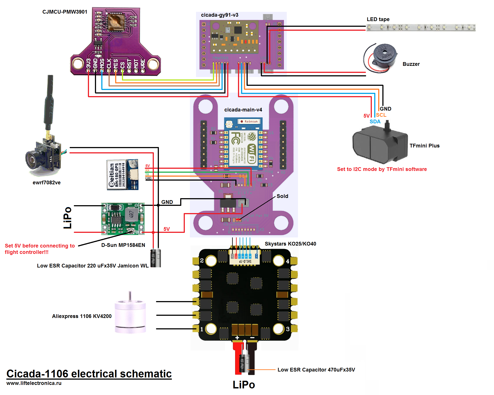
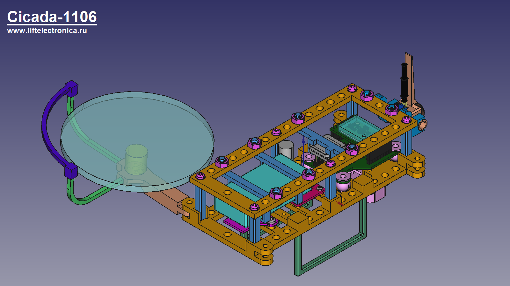
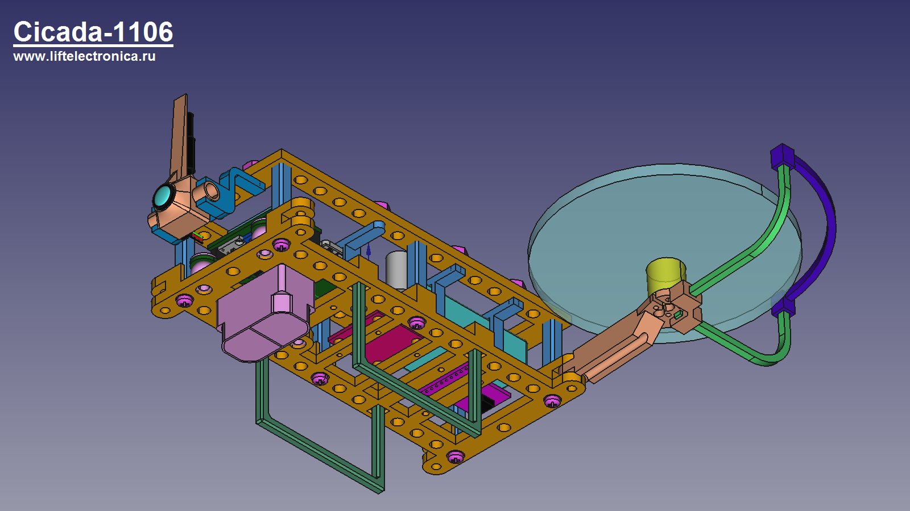

# Cicada-1106

Cicada-1106 is FPV quadcopter based on Cicada Flight Controller. Distance between motors 220mm in diagonal. Mass is 235 gram without propeller protection. Time of flight is about 5 minutes with GNB-850mAh-80C-2S battery

# Parts List
- cicada-main-v4 - flight controller based on ESP-07 module
- cicada-gy91-v3 - expansion board
- skystars ko25 - electronic speed controller
- aliexpress 1106 KV4200 - motors
- aliexpress 4045 - propellers
- ewrf7082ve - camera
- BN-180 - GPS module
- TFmini Plus - lidar
- CJMCU-PMW3901 - optical flow sensor

# Electrical schematic

# Views

