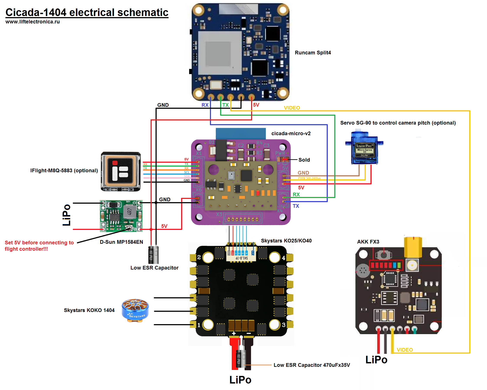
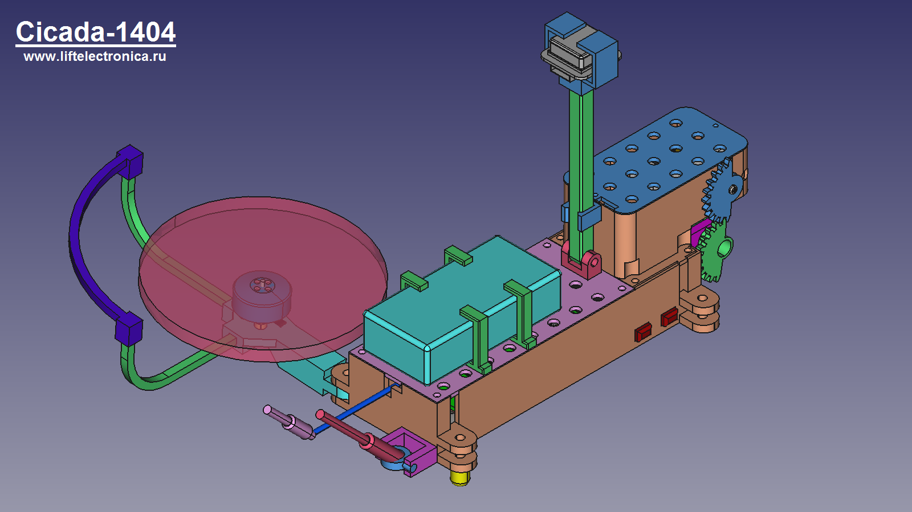
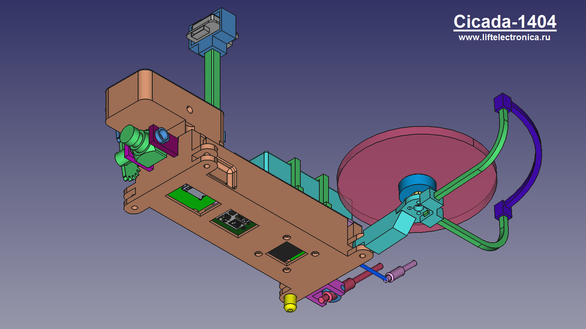

# Cicada-1404

Cicada-1404 is FPV quadcopter based on Cicada Flight Controller. Distance between motors 170mm in diagonal. Mass is 225 gram without gps module and propeller protection. As optional it can be equipped with GPS module. Time of flight is about 6 minutes with GNB-850mAh-80C-2S battery

# Parts List
- cicada-micro-v2 - flight controller based on ESP-07 module
- skystars ko25 - electronic speed controller
- skystars koko 1404 KV4600 - motors
- HQProp T3x2x2 - propellers
- runcam split4 - camera
- akk fx3 - 5.8 GHz video transmitter
- SG-90 - servo to control camera pitch
- IFlight M8Q-5883 - GPS module (optional)

# Electrical schematic

# Views

